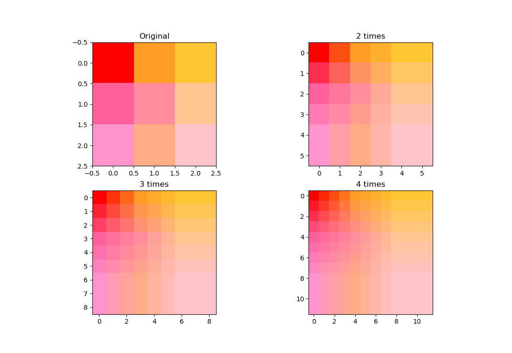

# 画像のサイズの拡大・縮小

#### 拡大
画像を拡大する際や，ノイズ等により画像中の一部のデータが得られない場合，不足する画素を補間する必要がある．例えば図1(a)は3×3の画像であるが，これを縦横それぞれ4倍に拡大することを考えてみる．4倍に拡大すると12×12=144の画素が必要になるが，もともと3×3=9画素分のデータしかないため，補間を行わないと(b)のように隙間のあいた画像になってしまう．最も簡単な補間法は，(c)のように画素のない部分に元の画素と同じ色を割り当てる方法である（０次補間と呼ぶ）．

０次補間では滑らかな画像が得られず，不自然な画像になる．これを改善するために，点x1の画素の値をf(x1)，点x2の画素の値をf(x2)としたとき，点x (x1 < x < x2)の値f(x)を

$$
f(x) = \frac{(x-x_1) f(x_2) + (x_2-x) f(x_1)}{x_2 - x_1}
$$

で表す方法がある．これを１次補間と呼ぶ．カラー画像の場合は赤・緑・青それぞれに対して補間を行えばよい．2次元画像の場合には横方向の補間を行った後縦方向の補間を行えばよい．１次補間では，色を直線的に近似した画像が得られる．図1(d)は１次補間を行った例である（右端，下端の画素は０次補間）．また，図2は実際の画像に適用した例である．

逆に画像を縮小する場合は，例えば元画像の縦横を1/Nに縮小する場合，元画像のN×N画素が縮小後の画像の1画素に対応する．この場合は対応する画素の平均値を新しい画素の値とすればよい．

# 課題
画像（./imgs/3x3.png）を拡大するプログラムを作成せよ．画像を2，3，4倍に拡大した結果を示せ．

拡大の結果例：

