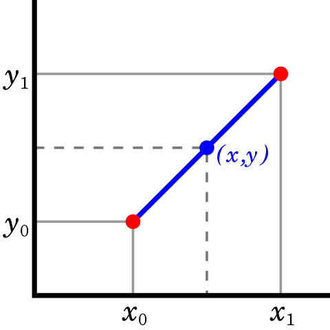
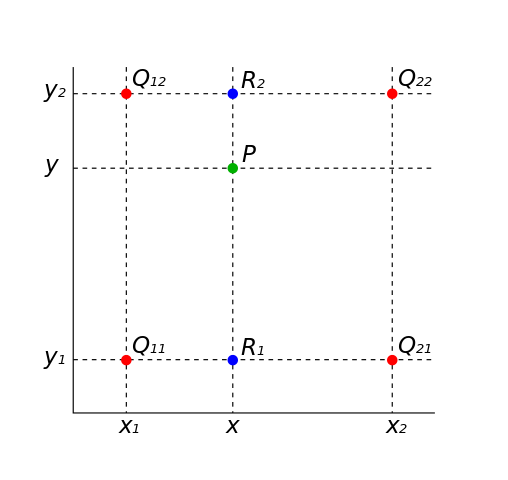
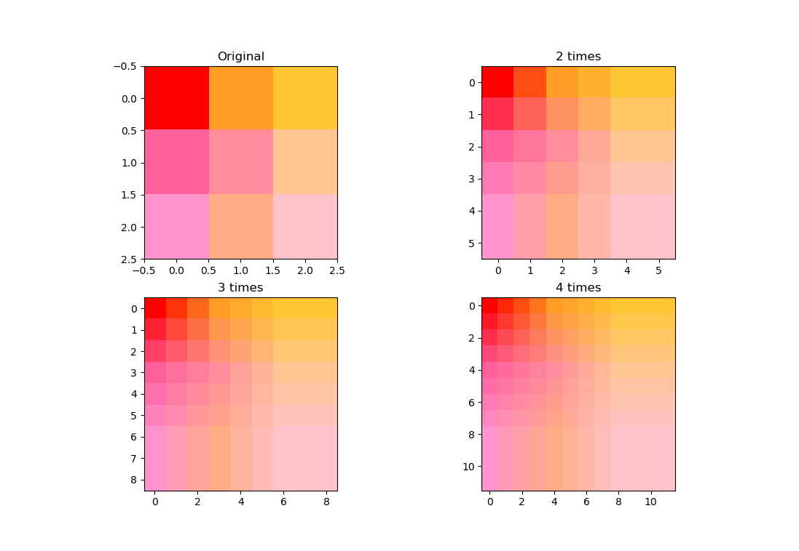

# 補完とは
> 数値表や観測で得られた値に基づいて，その間にある，表が載せないまたは観測していない数値に対する値を算出すること．(by Google)

例えば図1の二点のデータポイント $(y_0,x_0)$ と $(y_1,x_1)$ から，点 $(y,x)$ に置ける値を計算します．
||
|:-:|
|[図1](https://en.wikipedia.org/wiki/Linear_interpolation#/media/File:LinearInterpolation.svg)．線形補間の例．赤点がデータポイントで，青点の値を補完する．|

基本的な補完手法である[線形補間](https://en.wikipedia.org/wiki/Linear_interpolation)で補完します．

$x$ における $y$ はこのように計算します．
$$
y = \frac{y_0 \times (x - x_0) + y_1 \times (x_1 - x)}{x_1 - x_0}
$$

---

[バイリニア補完](https://en.wikipedia.org/wiki/Bilinear_interpolation)は，線形補間を2次元に拡張したものです．  
画素のインデックスのような二変数 $(x,y)$ 間の値を補完します（画素間の補完です）．  

||
|:-:|
|図2．バイリニア補完の例．赤点は既知の点．はじめに，x軸方向の二つの赤点から青点を補完し，最後に二つの青点から緑点を算出する．|

図2のように，四つの点 $(x_1,y_1), (x_2,y_1), (x_1,y_2), (x_2,y_2)$ が与えられたとします．各点の値は $f(x_1,y_1)$ と表します．

はじめに，x軸方向の二点 $(x_1,y_1)$ と $(x_2,y_1)$ から 点 $(x,y_1)$ の値を補完します．同様に $(x,y_2)$ も算出します．
$$
f(x,y_1) = \frac{f(x_1,y_1) \times (x_2 - x) +f(x_2,y_1) \times (x - x_1)}{x_2 - x_1}
$$

$$
f(x,y_2) = \frac{f(x_1,y_2) \times (x_2 - x) +f(x_2,y_2) \times (x - x_1)}{x_2 - x_1}
$$

最後に，y方向の二点 $(x,y_1), (x,y_2)$ を用いて点 $(x,y)$ の値を補完します．
$$
f(x,y) = \frac{f(x,y_1) \times (y_2 - y) + f(x,y_2) \times (y - y_1)}{y_2 - y_1}
$$

# 画像の拡大／縮小
画像サイズ（高さ $H$ ，幅 $W$ ）を $s$ 倍にします．

元画像 (高さ $H=4$, 幅 $W=4$ ，数値は画素値)：
|0|1|2|3|
|:-:|:-:|:-:|:-:|
|4|5|6|7|
|8|9|10|11|
|12|13|14|15|

0.5倍にした結果です．
|0|2|
|:-:|:-:|
|8|9|

## 方法1．単純な拡大縮小
計算機で実装できるように，処理手順の詳細を考えましょう．
$s = 0.5$とします．
まず，出力画像を用意します．  
出力画像サイズはどうなりますか？そう，$H' = H \times s = 2$，$W' = W \times s = 2$ですね．
|0|0|
|:-:|:-:|
|0|0|

次に，出力画素 $(j,i)$ と元画素 $(y,x)$ との対応関係は，このようになります．

|出力画素 $(j,i)$ |元画素 $(y,x)$|
|:-:|:-:|
|(0,0)|(0,0)|
|(0,1)|(0,2)|
|(1,0)|(2,0)|
|(1,1)|(2,2)|

どのような関係式で表現できるか考えてみましょう．
$$
y = \frac{j}{s}
$$

対応する画素値を代入してやれば，縮小結果を得られます．

### 補完があるとうれしい場合
$s = 0.75$ の場合を考えましょう．  
出力サイズは $3 \times 3$ になります．

|0|0|0|
|:-:|:-:|:-:|
|0|0|0|
|0|0|0|

対応関係を計算します．
|出力画素 $(j,i)$ |元画素 $(y,x)$|
|:-:|:-:|
|(0,0)|(0,0)|
|(0,1)|(0,0.75)|
|(0,2)|(0,1.5)|
|(1,0)|(0.75,0)|
|(1,1)|(0.75,0.75)|
|(1,2)|(0.75,1.5)|
|(2,0)|(1.5,0)|
|(2,1)|(1.5,0.75)|
|(2,2)|(1.5,1.5)|

## 方法2．線形補完を用いた補完
$s = 0.75$の場合を考えてみましょう．  

出力画像を用意します．$H' = 4 \times 0.75 = 3$，$W' = 8 \times 0.75 = 6$
|0|0|0|0|0|0|
|:-:|:-:|:-:|:-:|:-:|:-:|
|0|0|0|0|0|0|
|0|0|0|0|0|0|

対応関係を計算します．
|出力画素 $(j,i)$ |元画素 $(y,x)$|
|:-:|:-:|
|(0,0)|(0,0)|
|(0,1)|(0,2)|
|(0,2)|(0,4)|
|(1,0)|(2,0)|
|(1,1)|(2,2)|
|(1,2)|(2,4)|

# 課題
画像（./imgs/3x3.png）を拡大するプログラムを作成せよ．画像を2，3，4倍に拡大した結果を示せ．

拡大の結果例：

