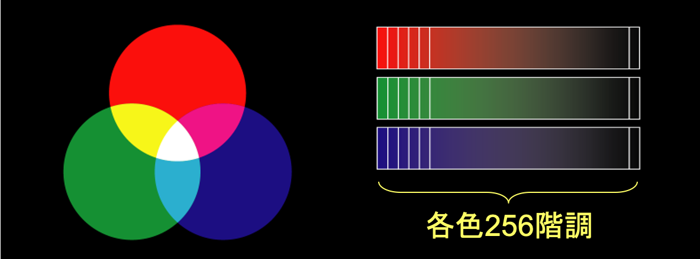
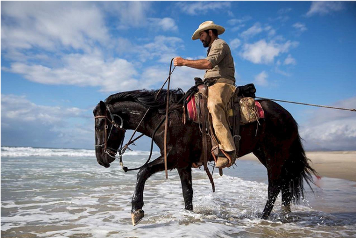
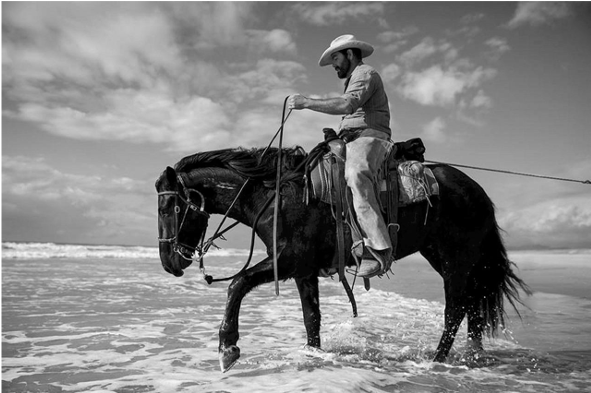
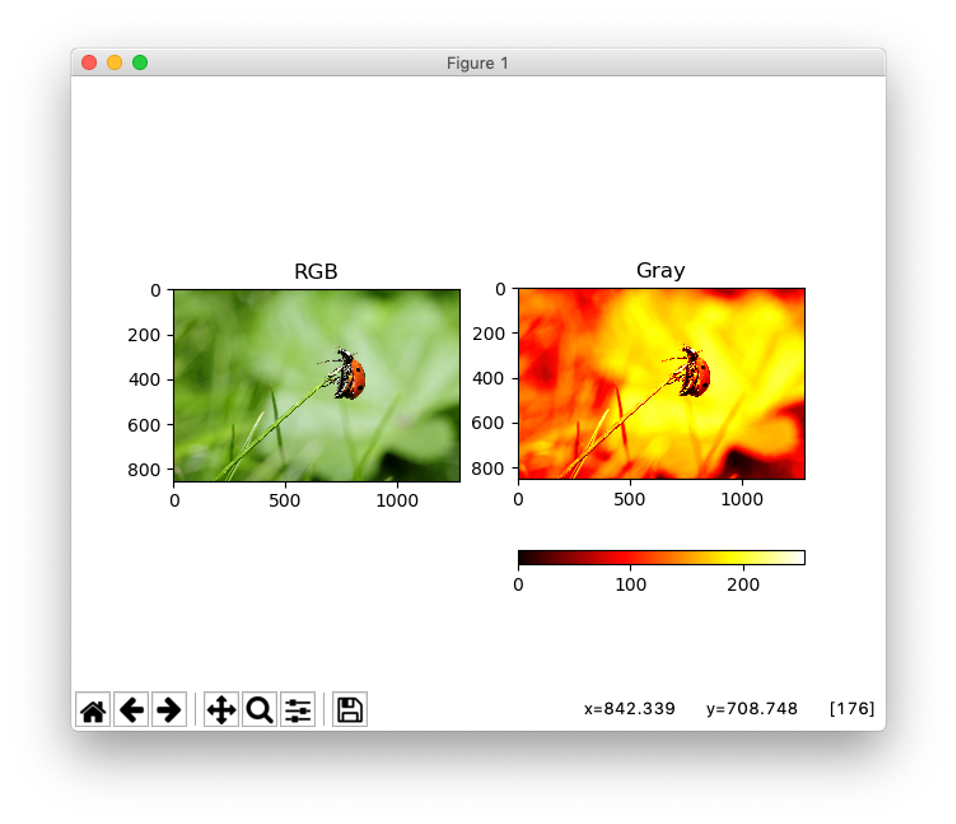

# グレースケール変換

#### デジタル画像の色について
- 色は光の３原色（赤・緑・青）で表現する　→　RGB
- 赤、緑、青それぞれに諧調を持たせることで、様々な色を表現できる


#### グレースケール画像
- 輝度値（物体の明るさ）のみを持つ画像
- カラー画像の画素をグレースケールにする変換式：
$$
I = 0.2989 \times R + 0.5870 \times G + 0.1140 \times B
$$


|||
|:-:|:-:|
|RGB|グレースケール|


# 課題
- カラー画像を入力とし、グレースケール画像を出力せよ

#### ヒント（
- 便利なIpythonコマンド
```
ファイルを実行：　run filename.py
変数を表示： whos
切り捨て：　np.floor( x )
切り上げ： np.ceil( x )
丸め込み：np.around( x )
データ型の変換： x.astype(‘uint8’)
```

- 画像を並べて表示する例
```
fig = plt.figure()
# Set original image
a = fig.add_subplot(1, 2, 1)
imgplot = plt.imshow(img)
a.set_title('RGB’)

# Set gray scaled image
a = fig.add_subplot(1, 2, 2)
imgplot = plt.imshow(out)
imgplot.set_cmap('hot')  # 'viridis', 'inferno', 'magma', 'cividis', 'gray', 'hot'
a.set_title('Gray’)
plt.colorbar(orientation='horizontal')
```


