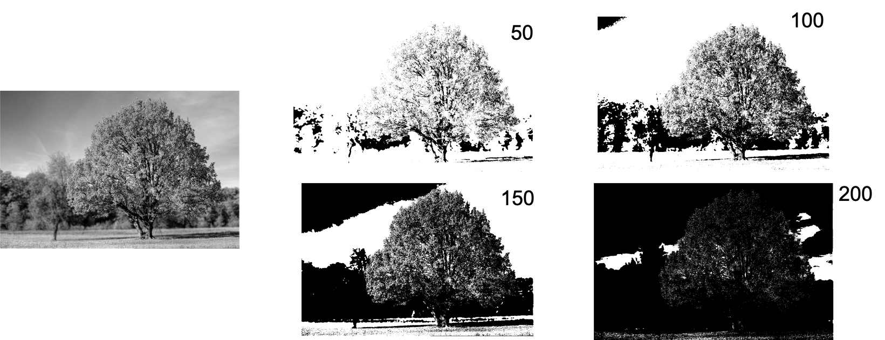
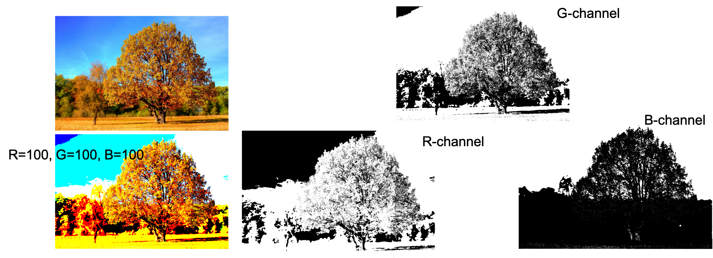

# 閾値処理

- 閾値（しきいち）とは？　→ 境目となる値のこと
- 閾値処理とは？
  - ある値（閾値）よりも大きければ，画素を白にする．
  - 小さければ，画素を黒にする．

#### 練習問題
- 閾値処理を数式で書いてみよう．画素値を$x$，閾値を$T$とする．画素を白にするには・・・どんな値を入れるか考えてみよう．

$$
x = \left\{ \begin{array}{ll}
  ? & (条件式) \\
  ? & (条件式)
\end{array} \right.
$$

# 課題1
- グレースケール画像を閾値処理するプログラムを作成せよ．
- 閾値を50，100，150，200として，閾値処理をせよ．

# 課題2
- カラー画像に対して閾値処理をするプログラムを作成せよ．（チャンネル毎に閾値処理をする）

