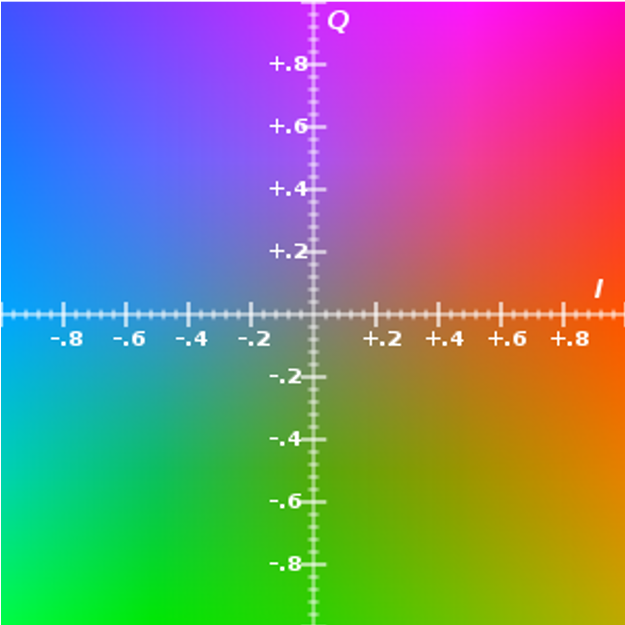
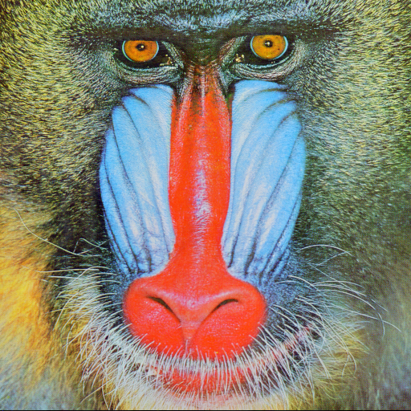
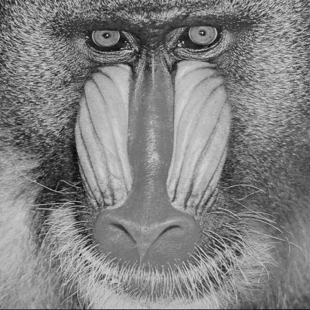
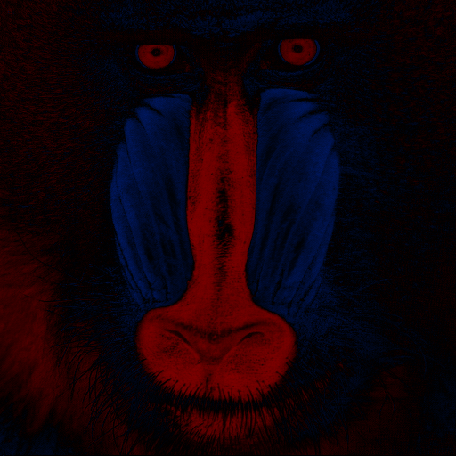
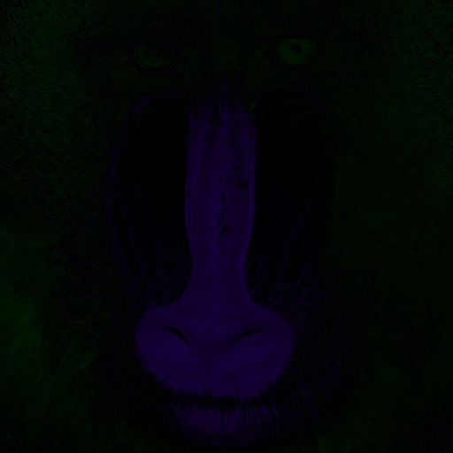

# 表色系の変換

#### 表色系とは

- 表色系とは色の表現方法のひとつです．（例：RGB，YIQ（テレビ用），YUV（JPEG画像）
  ）
- YIQ表色系について（Yは輝度，Iはオレンジからシアンの色調，Qはその他
  ）
- 人間はYとIに敏感だが，Qには鈍感である
- よって，YIに多くの帯域を割り当てることで，効率的に信号を伝送できる

図１．YIQ表色系．Y=0.5．https://en.wikipedia.org/wiki/YIQ

#### 変換式

$$
\left ( \begin{array}{lll} y\\ I\\ Q \end{array} \right) =
 \left ( \begin{array}{lll}
 0.299 &0.587 &0.114\\
 0.596 &-0.274 &-0.322\\
 0.211 &-0.523 &0.312
 \end{array} \right)
 \left ( \begin{array}{lll} R\\ G\\ B \end{array} \right)
$$

$$
\left ( \begin{array}{lll} R\\ G\\ B \end{array} \right) =
 \left ( \begin{array}{lll}
 1 &0.956 &0.621\\
 1 &-0.273 &-0.647\\
 1 &-1.104 &1.70
 \end{array} \right)
 \left ( \begin{array}{lll} Y\\ I\\ Q \end{array} \right)
$$

# 課題

YIQの各成分の効果をみるために、画像をYIQ形式に変換し、Y、I、Qのうち1つの要素のみを残してほかの要素は一定値（すべての画素の平均値など）にした後RGBにもどした画像を生成してみよ。

| 入力                           | Y                              | I                              | Q                              |
|:----------------------------:|:------------------------------:|:------------------------------:|:------------------------------:|
|  |  |  |  |
