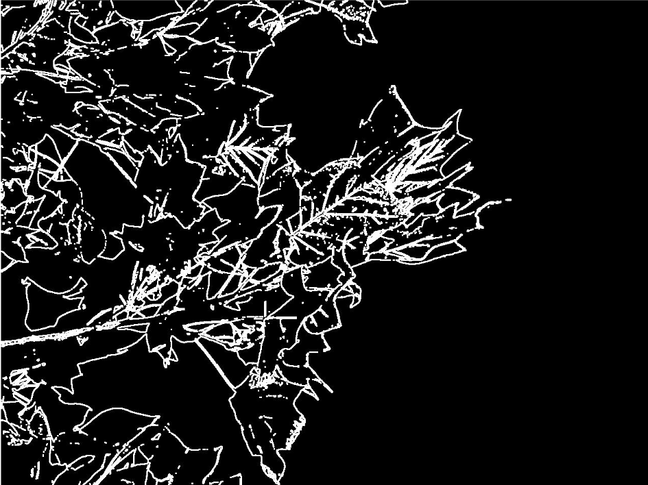
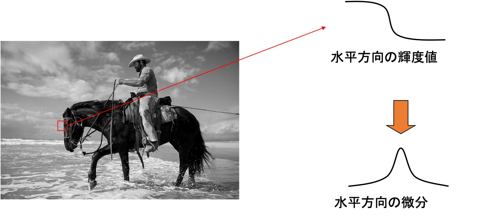
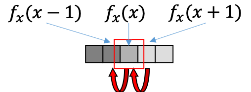
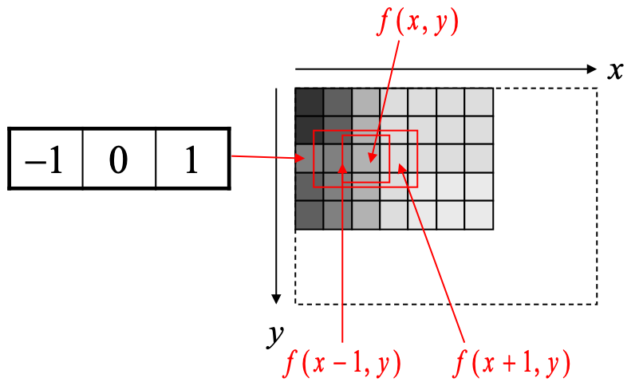
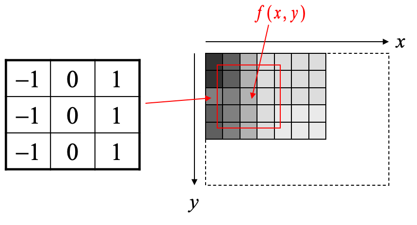
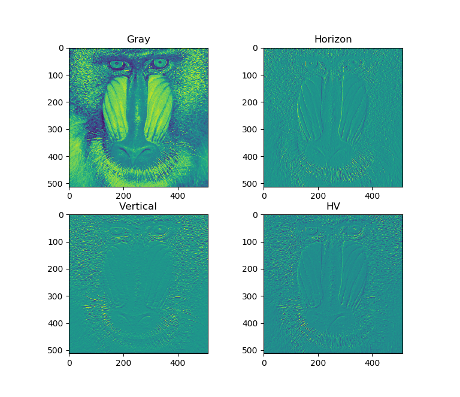
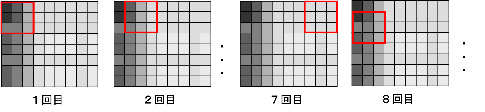

# エッジ検出

#### エッジとは
- エッジとは，濃淡値が急激に変化する画像中の箇所
- 左下の画像だと，どこがエッジになると思いますか？

|Gray|Edge|
|:-:|:-:|
|||

#### 検出方法の考え方
- 画像を微分して、エッジを検出する

- **水平方向** に微分演算を行う．デジタル画像の場合、近似的に$h=1$とする．つまり，画素単位での演算となる．
$$
f_x(x) = \lim_{h \to 0} \frac{f(x+h) - f(x)}{h}
$$

- 両側から微分し，平均を計算する．

$$
f_x(x) = \frac{1}{2}[\{f(x+1)-f(x)\} + \{f(x) - f(x-1)\}]\\
$$
まとめると，
$$
f_x(x) = \frac{1}{2} \{f(x+1) - f(x-1)\}
$$

- 効率化のため，計算式を実現するフィルタを考えます
  + 係数を無視した式を考えます．$f_x(x) = f(x+1) - f(x-1)$
  + 1行3列のフィルタで，中心の画素値を計算します

- 精度を上げるために，上下の画素を利用します
$f_x(x,y) = f(x+1,y-1) + f(x+1,y) + f(x+1,y+1)$  
$- f(x-1,y-1) - f(x-1,y) - f(x-1,y+1)$

- 垂直方向の微分を計算するフィルタです
$f_y(x,y) = f(x-1,y+1) + f(x,y+1) + f(x+1,y+1)$  
$- f(x-1,y-1) - f(x,y-1) - f(x+1,y-1)$

#### ソーベルフィルタ (Sobel Filter)
- 水平方向

|-1|0|1|
|:-:|:-:|:-:|
|-2|0|2|
|-1|0|1|

- 垂直方向

|-1|-2|-1|
|:-:|:-:|:-:|
|0|0|0|
|-1|-2|-1|

# 課題
- Sobelフィルタを実装しよう

- 実装のポイント
1. ラスタスキャンの要領でフィルタを移動させよう
1. ラスタスキャンを実装する際、画像の端に注意しよう
1. エッジの計算結果を画像表示する際，値域が[0,1]となるように正規化する必要あり．最大値が1，最小値が0となる．

