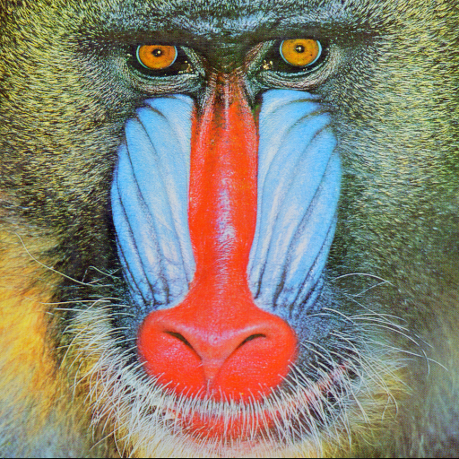

# 色情報を用いた画像処理

カラー画像を扱う場合、輝度値だけではなく色情報を利用することができる。輝度値のみを扱う場合と異なり、色情報を用いる場合、各画素は3つの値をもつ。これを3次元ベクトルとみなす。例えばRGB表色系を用いる場合、各画素の赤・緑・青の値をそれぞれr、g、bとする3次元ベクトル（r, g, b）となる。これを用いて、色の「違い」を定義することができる。最も簡単なものは、画素1の色を（r1, g1, b1）、画素2の色を（r2, g2, b2）とすると、

$$
d = (r_1 - r_2)^2 + (g_1 - g_2)^2  + (b_1 - b_2)^2
$$

と表すことができる。逆に、dが小さければ色が「似ている」ことを意味する。

これを用いて、各画素の色の近さを元に領域を分類することができる。例えば、上の赤・緑・青のベクトルで表せば赤の画素は(255,0,0)、緑の画素は(0,255,0)、青の画素は(0,0,255)と表せる。これらの点に対応する色を基準色とし、画像の各画素が、これら3点のうちどの点に一番「近い」かを計算し、その近い点の色で置き換える。もちろん、これ以外の点(127,255,0)などを基準色とすることもできる。

図1に例を示す。(a)の画像の各画素が赤、青、緑のどの点に近いかで3種類に分類したものが(b)、これに黒(0,0,0)を加えたものが(c)、さらに白(255,255,255)を加えたものが(d)である。

これらの画像はまだ細かい情報を「忠実」に再現しているが、色の分類を行う前に平滑化を行うことで細かい情報を取り除き、ある程度の領域分割を行うことができる。(e)は色分類を行う前の画像に11×11の平滑化フィルタ（赤・緑・青の色ごとに、各画素を中心とする11×11の画素の輝度の平均値を求め、その中心の画素の値とする）を適用したものであり、(f)は平滑化フィルタ適用後に赤・緑・青の3色に分類したものである。

||||
|:-:|:-:|:-:|
|入力画像|RGB|RGB + B|
||||
|RGB + B + W|平滑化|平滑化 + RGB|

# 課題
1. 入力画像を3色に変換せよ．（赤，緑，青）
2. 4色に変換せよ．（赤．緑，青，黒）
3. 5色に変換せよ．（赤．緑，青，黒，白）
4. 11 * 11のフィルタで平滑化した画像を出力せよ．
5. 平滑化した画像を3色に返還せよ．（赤，緑，青）
