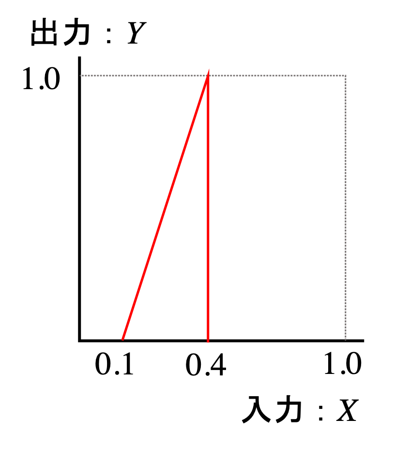
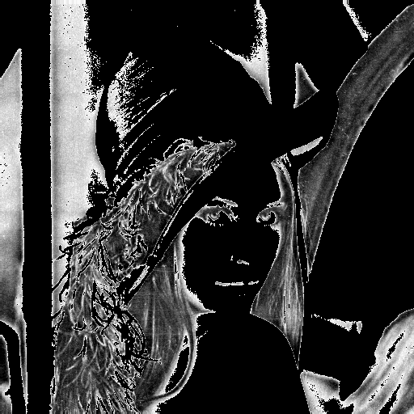
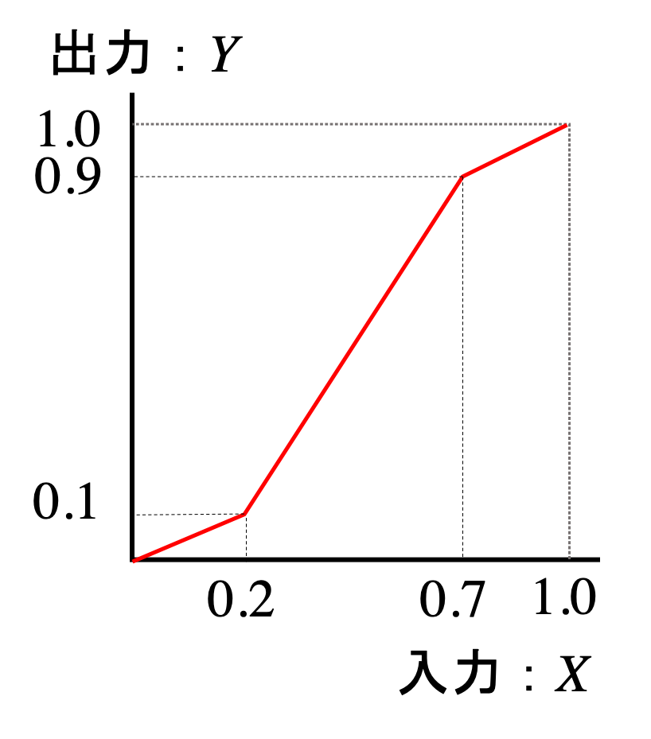
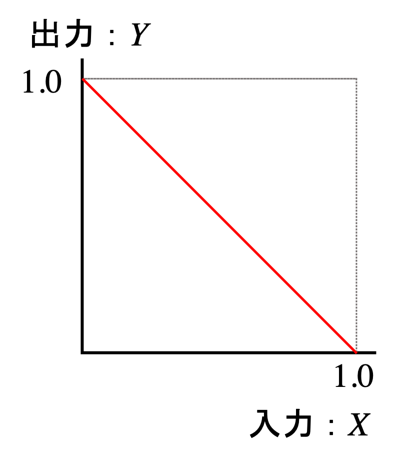
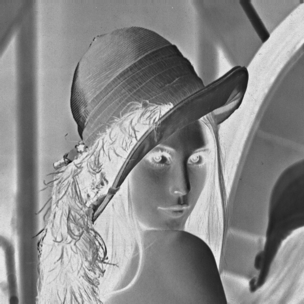
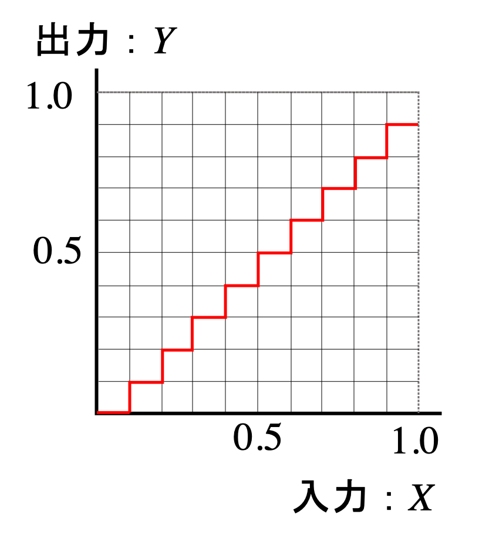

# 濃度値の補正

#### ガンマ補正
ディジタル画像の濃度（輝度）値を様々な方法で補正してみよう．例えばガンマ補正とは，元の画像のある画素の輝度値を$X$としたときに，その画素の輝度値 $Y$ を $Y = X^{1/\gamma}$ と変換するものである（右図）．例えば $\gamma = 2.0$ の場合は，元の画像の暗い部分を「拡大」することに相当する．様々な $\gamma$ の値でガンマ補正を行なった例を下図に示す．

||||||
|:-:|:-:|:-:|:-:|:-:|
|元画像|$\gamma = 0.1$|$\gamma = 0.5$|$\gamma = 2.0$|$\gamma = 10.0$|

#### その他の補正
ガンマ変換のほかにも，様々な変換を行なうことができる．以下に例を示す．

1. 拡大強調：ある範囲のみ、階調を拡大して表示
  

2. 中間輝度レベル強調：部分区間の階調を拡大

3. 反転

4. 階調数変換（n値化）

# 課題
ガンマ補正，およびその他の補正を実装せよ．
